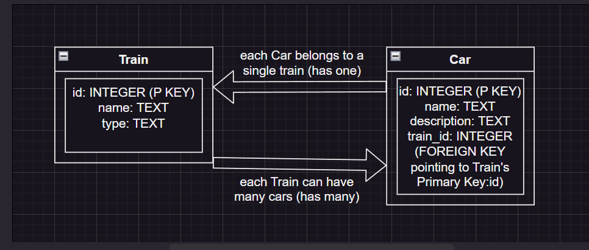

# RAILYARD COMMANDER, CLI EDITION

## Created by Kenneth Richlin

## Get the Latest Version from our [Github Repo](https://github.com/krichlin/Railyard-Commander)

## Installation Instructions

- To initialize the environment, type `pipenv install`
- You should populate the database with some test data by running `python lib/seed.py`
- You can run the CLI by typing the command `python lib/cli.py`

## Let's Play Railyard Commander!

It's up to you to manage the trains in the B&O Railroad company!

Explore all the options in the menu: Try Creating a New Train, adding cars to your train, and removing a train.  

Then you're off to the races!  

## Details on the Files in the Project

- lib/debug.py - A debug file to assist in testing our class methods.  

- lib/seed.py You should run `python lib/seed.py` once to initialize the databse and populate it with some sample data.

- lib/cli.py - Run `python lib/cli.py` to start the main program.  This file contains our menu and will accept user input.  You will be presented with a menu of options.  The various options will allow you to View all Trains, View all Cars, show Trains by ID or Name, Show cars by ID, show all Cars on a Train, and Remove a Train.

- lib/helpers.py - This file contains a collection of helper methods called by cli.py .  Each method carries out a specific function for the CLI.

- railyard.db - Our SQLite database containing Tables for our Trains and Cars.  If you ran `python lib/debug.py`, this should be populated with some test data.

- README.md - The file you're reading right now!

- relationships.drawio - An illustration showing the object attributes and relationships for Train and Car classes.  

- lib/models/train.py - This is where the Train class, along with its attributes and methods are defined.  Here you will find a variety of ORM methods that are useful for interacting with the database.

- lib/models/car.py - This is where the Car class, along with its attributes and methods are defined.  Here you will find a variety of ORM methods that are useful for interacting with the database.

## Screenshot of our object diagram

